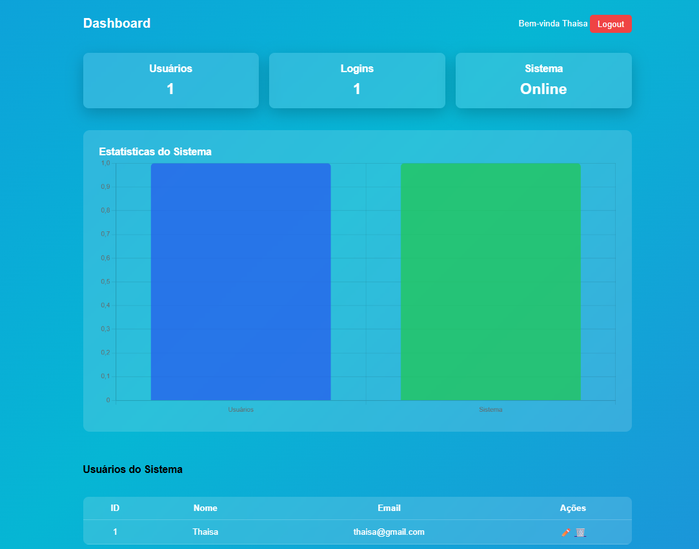

# 🔐 Sistema de Login com FastAPI

Sistema completo de autenticação desenvolvido com **FastAPI**, contendo cadastro, login, dashboard, edição de usuários e autenticação segura com **JWT**.

---

## 🚀 Funcionalidades

* ✅ Cadastro de usuários
* ✅ Login com autenticação segura
* ✅ Proteção de rotas com JWT
* ✅ Dashboard com estatísticas
* ✅ Edição e exclusão de usuários
* ✅ Validação de email
* ✅ Senhas criptografadas (hash)
* ✅ Testes automatizados com Pytest

---

## 🛠️ Tecnologias utilizadas

* Python
* FastAPI
* SQLite
* Jinja2 (templates HTML)
* JWT (JSON Web Token)
* Pytest
* HTML + CSS

---

## 📸 Demonstração

### 🔑 Tela de Login

<!-- Coloque aqui o print depois -->


### 📊 Dashboard

<!-- Coloque aqui o print depois -->



---

## ⚙️ Como executar o projeto

### 1. Clone o repositório

```bash
git clone https://github.com/Thaisa-Cristina/sistema-login-fastapi.git
cd sistema-login-fastapi
```

### 2. Crie o ambiente virtual

```bash
python -m venv venv
```

### 3. Ative o ambiente

**Windows:**

```bash
venv\Scripts\activate
```

**Linux/Mac:**

```bash
source venv/bin/activate
```

### 4. Instale as dependências

```bash
pip install -r requirements.txt
```

### 5. Execute o projeto

```bash
uvicorn main:app --reload
```

### 6. Acesse no navegador

```bash
http://127.0.0.1:8000
```

---

## 🧪 Testes

Para rodar os testes:

```bash
pytest
```

---

## 🔐 Segurança

* Senhas protegidas com hash (bcrypt)
* Autenticação baseada em JWT
* Rotas protegidas com validação de token

---

## 📌 Melhorias futuras

* Deploy em produção (Render/Railway)
* Integração com banco PostgreSQL
* Sistema de permissões (roles)
* API REST completa
---
